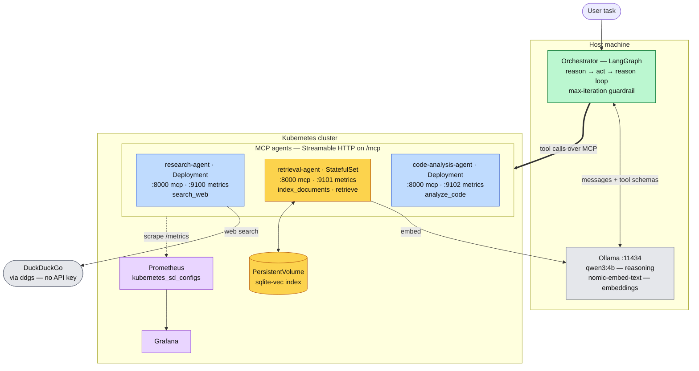

# Distributed Agent Orchestrator

A multi-agent system where a LangGraph orchestrator routes tasks across
specialized agents, each exposed as its own MCP (Model Context Protocol)
server and deployed as an independent service on Kubernetes, with
Prometheus/Grafana observability across the whole system.

Built to extend prior work on adaptive distributed systems ([AdapTrain](#))
into the current agentic-AI tooling landscape.

## Architecture

Three specialized MCP servers, one orchestrator:

| Agent | Tools | State | Deployed as |
|---|---|---|---|
| **research** | `search_web` | none | Deployment |
| **retrieval** | `index_documents`, `retrieve` | persistent vector index | StatefulSet + PVC |
| **code-analysis** | `analyze_code` | none | Deployment |

The orchestrator (LangGraph) runs a reason -> act -> reason loop: it asks
an LLM what to do, calls the relevant MCP tool, feeds the result back, and
repeats until the LLM produces a final answer or a max-iteration guardrail
is hit.

Each agent runs as its own Kubernetes workload, so it can be restarted,
scaled, and monitored independently. Prometheus scrapes per-agent metrics
(latency, call counts, error rates, corpus size) via Kubernetes service
discovery; Grafana dashboards visualize them.

### System diagram



**Reading the diagram.** Solid arrows are request paths, dotted arrows are
metrics scraping. The amber components are the only **stateful** part of the
system — the retrieval agent and its volume — which is why that one agent is a
StatefulSet while the blue agents are Deployments. The blue agents can be scaled
to any number of replicas; the amber one cannot, because each replica would get
its own volume and its own divergent corpus.

Two edges cross the host/cluster boundary and are worth noting: the orchestrator
reaches the agents from outside the cluster (their Services are `ClusterIP`, so
this needs `kubectl port-forward`, a `NodePort`, or moving the orchestrator
in-cluster), and the retrieval agent calls back out to Ollama on the host via
`host.docker.internal`.

> This is the target topology. Today the orchestrator and all three agents run
> as local processes on the host; the Kubernetes deployment is Week 2.

## Why multiple small MCP servers instead of one

A single MCP server with all tools would work and is simpler. This
project deliberately splits into separate services to practice and
demonstrate independent deployment, independent scaling, and isolated
failure handling.

The retrieval agent is what makes that split load-bearing rather than
decorative: it owns an index that must outlive its process, so it's the one
agent that needs a StatefulSet, a PersistentVolume, and a readiness probe -
and the one that *can't* be scaled horizontally without a redesign. See
`docs/architecture.md` for the full writeup, including why an earlier
summarizer agent was removed for failing this test.

## Design decision: sync vs. async tool execution

All agents execute tool calls synchronously (request in, result out, no
queue). A code-execution sandbox is the documented stretch-goal candidate
for an async worker-queue pattern, since running untrusted code is the case
where decoupling the listener from execution genuinely earns its complexity.

## Local setup (no cloud required)

Runs entirely on your own machine. No cloud account or GPU rental needed.
Verified on a 4GB-VRAM laptop GPU.

### 1. Install Ollama and pull the models

```bash
winget install --id Ollama.Ollama --source winget
```

```bash
ollama pull qwen3:4b
```

```bash
ollama pull nomic-embed-text
```

`qwen3:4b` fits entirely in 4GB of VRAM and handles this tool surface
reliably. The model **must** support tool calling - one that doesn't will
answer in prose and never emit a tool call, which looks like a broken graph
but isn't. Check with `ollama show <model>` and look for `tools`.

### 2. Install Python dependencies

```bash
python -m venv .venv
```

```bash
.venv/Scripts/python.exe -m pip install -r requirements-dev.txt
```

### 3. Run the agents

Each in its own terminal. `MCP_PORT` is overridden because all three default
to 8000 (correct in Kubernetes, where each pod has its own network namespace,
but colliding on one machine):

```bash
MCP_PORT=18000 .venv/Scripts/python.exe agents/research_agent/server.py
```

```bash
MCP_PORT=18001 .venv/Scripts/python.exe agents/retrieval_agent/server.py
```

```bash
MCP_PORT=18002 .venv/Scripts/python.exe agents/code_analysis_agent/server.py
```

> **Windows note:** the local defaults are ports 18000-18002 rather than
> 8000-8002 because Windows reserves large TCP ranges for Hyper-V/WSL/Docker,
> and 8000 commonly falls inside one - binding it fails with WinError 10013
> even as Administrator. Check yours with
> `netsh interface ipv4 show excludedportrange protocol=tcp`.

### 4. Run the orchestrator

```bash
.venv/Scripts/python.exe -m orchestrator.main
```

### Kubernetes

```bash
winget install --id Kubernetes.kind --source winget
```

```bash
kind create cluster --name agent-orchestrator
```

Build each image and load it into the cluster (repeat per agent — the manifests
use `imagePullPolicy: IfNotPresent`, so the node needs a local copy):

```bash
docker build -t agent-orchestrator/research-agent:latest agents/research_agent
```

```bash
kind load docker-image agent-orchestrator/research-agent:latest --name agent-orchestrator
```

```bash
kubectl apply -f k8s/
```

The agents' Services are `ClusterIP`, so the orchestrator — which runs on the
host — reaches them by port-forwarding onto the same ports its config already
defaults to:

```bash
kubectl port-forward service/retrieval-agent-service 18001:8000
```

The retrieval agent reaches Ollama back on the host via `host.docker.internal`.
That works on Docker Desktop, where a DNS resolver knows the name and the
network proxy can reach services bound to the host's loopback interface — which
matters, since Ollama binds `127.0.0.1` by default. It does not generalise to
kind over native Linux Docker; see the comments in `k8s/retrieval-agent.yaml`.

**Resource note:** the cluster and local inference compete on a 16GB laptop.
Running kind alongside a 4B model leaves little headroom, and heavy GPU
contention while Docker Desktop's WSL2 backend is active has been observed to
destabilise the NVIDIA driver.

## Tests

```bash
.venv/Scripts/python.exe -m pytest
```

Loop logic and vector-store tests run without an LLM or any servers, using
fakes. Integration tests exercise the real MCP protocol and skip automatically
when the agents aren't running, so the suite is green on a fresh checkout.

## Evaluation

See `eval/`. A fixed set of representative tasks run through the full
system, checked against automated signals (required tools actually called,
keyword matches) and an LLM-judge quality score.

Tool expectations are split into `required_tools` and `allowed_tools`:
asserting optional tools tests prompt compliance rather than task success,
and fights every prompt improvement.

Results: TODO, populate after the LLM-judge pass is implemented.

## Observability

Grafana dashboard screenshots: TODO.

Per-agent metrics on ports 9100-9102: `tool_calls_total{tool_name,status}`,
`tool_call_duration_seconds`, and `retrieval_documents_total` (corpus size -
a stateless agent's metrics are all flow, a stateful one also has a size).

## Status

Work in progress. Week 1 complete: all three agents serve over Streamable
HTTP, the orchestrator loop runs end to end against a local model, and the
retrieval corpus persists across restarts. Build plan and design decisions
tracked in `docs/architecture.md`.
