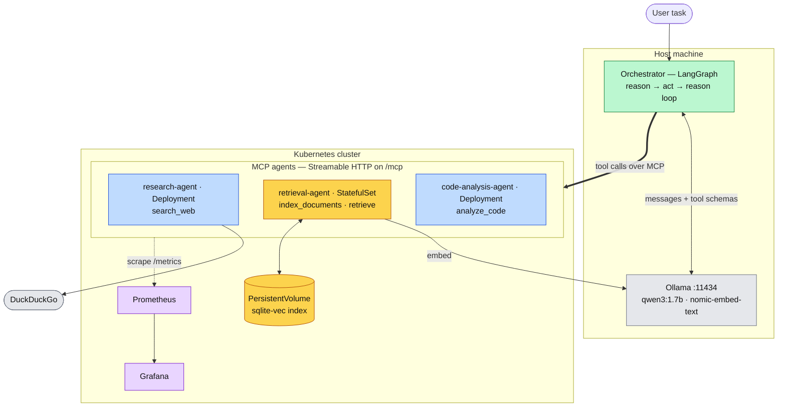

# Distributed Agent Orchestrator

A LangGraph orchestrator that routes tasks across specialized agents, each
exposed as its own MCP (Model Context Protocol) server and deployed as an
independent Kubernetes service, with Prometheus/Grafana observability.

Runs entirely locally — no cloud account, no GPU rental, no API keys.

## Architecture

| Agent | Tools | State | Deployed as |
|---|---|---|---|
| **research** | `search_web` | none | Deployment |
| **retrieval** | `index_documents`, `retrieve` | vector index | StatefulSet + PVC |
| **code-analysis** | `analyze_code` | none | Deployment |

The orchestrator runs a reason → act → reason loop: ask the LLM what to do, call
the MCP tool it picks, feed the result back, repeat until it answers or hits the
max-iteration guardrail.



Amber is the only stateful part of the system, which is why it's a StatefulSet
with a volume and why it alone can't be scaled horizontally. Dotted arrows are
metrics scraping.

**[docs/architecture.md](docs/architecture.md)** covers the design decisions —
why separate MCP servers, why the summarizer agent was cut, and the hardware
limits that shaped the model and deployment choices.

## Quickstart

**1. Models** (must support tool calling — check `ollama show <model>` for `tools`)

```bash
ollama pull qwen3:1.7b && ollama pull nomic-embed-text
```

**2. Dependencies**

```bash
python -m venv .venv && .venv/Scripts/python.exe -m pip install -r requirements-dev.txt
```

**3. Agents** — one per terminal

```bash
MCP_PORT=18000 .venv/Scripts/python.exe agents/research_agent/server.py
```

```bash
MCP_PORT=18001 .venv/Scripts/python.exe agents/retrieval_agent/server.py
```

```bash
MCP_PORT=18002 .venv/Scripts/python.exe agents/code_analysis_agent/server.py
```

**4. Orchestrator**

```bash
.venv/Scripts/python.exe -m orchestrator.main
```

## Kubernetes

```bash
kind create cluster --name agent-orchestrator
```

Build and load each agent image (the manifests use `imagePullPolicy: IfNotPresent`):

```bash
docker build -t agent-orchestrator/research-agent:latest agents/research_agent
```

```bash
kind load docker-image agent-orchestrator/research-agent:latest --name agent-orchestrator
```

```bash
kubectl apply -f k8s/
```

Services are `ClusterIP`, so port-forward to reach them from the host — onto the
same ports the orchestrator config already defaults to:

```bash
kubectl port-forward service/retrieval-agent-service 18001:8000
```

## Tests

```bash
.venv/Scripts/python.exe -m pytest
```

Loop and vector-store tests use fakes and need nothing running. Integration
tests exercise the real MCP protocol and skip when the agents are down, so the
suite is green on a fresh checkout.

## Observability

Prometheus and Grafana deploy with everything else.

```bash
kubectl port-forward service/grafana-service 13000:3000
```

Grafana at `localhost:13000`, datasource and dashboard already provisioned.
Metrics: `tool_calls_total`, `tool_call_duration_seconds`,
`retrieval_documents_total`. Discovery is annotation-driven — a new agent opts
in with `prometheus.io/scrape`, no config edit.

## Evaluation

```bash
.venv/Scripts/python.exe -m eval.run_eval
```

Runs `eval/test_cases.json` through the full system and scores each result on
automated signals (required tools called, keyword match) plus an LLM judge that
grades the answer against the tool output it was actually given.

Latest run — `qwen3:1.7b`, three cases, ~41 s:

| case | required tool called | grounding | completeness | relevance |
|---|---|---|---|---|
| mcp-adoption-summary | yes | 5 | 5 | 5 |
| cached-retrieval | **no** | 5 | 5 | 5 |
| code-review-basic | yes | 5 | 5 | 5 |

**Known limitation:** `cached-retrieval` fails because the model calls
`search_web` without trying `retrieve` first, even though the corpus holds
relevant documents and the system prompt says otherwise. Prompt changes did not
fix it; `qwen3:4b` follows the ordering rule correctly. That is the cost of the
smaller default model, and the harness exists to make it visible.

The two signals disagree on that row deliberately: the answer really was
well-grounded, it just reached the evidence the expensive way. A single blended
score would have hidden the routing failure.

## Status

Orchestration loop, all three agents, Kubernetes deployment and observability
are working. Remaining: a first full evaluation run, and a UI.
