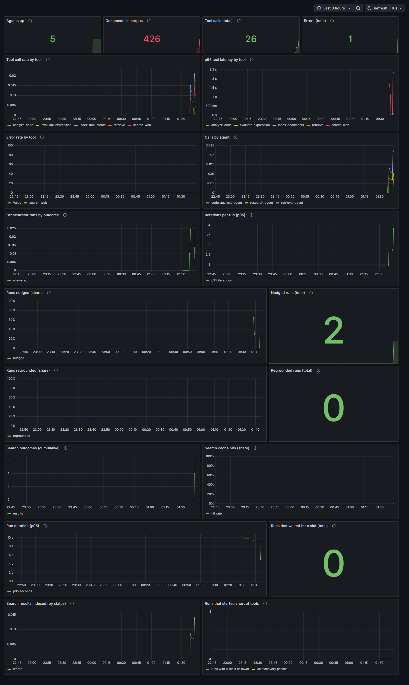

# Distributed Agent Orchestrator

[](https://github.com/mh-naderi/distributed-agent-orchestrator/actions/workflows/tests.yml)

A LangGraph orchestrator that routes tasks across specialized agents, each
exposed as its own MCP (Model Context Protocol) server and deployed as an
independent Kubernetes service, with Prometheus/Grafana observability.

Runs entirely locally — no cloud account, no GPU rental, no API keys.

## Architecture

| Agent | Tools | State | Deployed as |
|---|---|---|---|
| **research** | `search_web` | none | Deployment |
| **retrieval** | `index_documents`, `retrieve` | vector index | StatefulSet + PVC |
| **code-analysis** | `analyze_code`, `evaluate_expression` | none | Deployment |

The orchestrator runs a reason → act → reason loop: ask the LLM what to do, call
the MCP tool it picks, feed the result back, repeat until it answers or hits the
max-iteration guardrail.


Amber is the only stateful part of the system, which is why it's a StatefulSet
with a volume and why it alone can't be scaled horizontally. Dotted arrows are
metrics scraping.

**[docs/architecture.md](docs/architecture.md)** covers the design decisions —
why separate MCP servers, why the summarizer agent was cut, and the hardware
limits that shaped the model and deployment choices.

## Quickstart

**1. Models** (must support tool calling — check `ollama show <model>` for `tools`)

```bash
ollama pull qwen3:1.7b && ollama pull nomic-embed-text
```

**2. Dependencies**

```bash
python -m venv .venv && .venv/Scripts/python.exe -m pip install -r requirements-dev.txt
```

**3. Agents** — one per terminal

```bash
MCP_PORT=18000 .venv/Scripts/python.exe agents/research_agent/server.py
```

```bash
MCP_PORT=18001 .venv/Scripts/python.exe agents/retrieval_agent/server.py
```

```bash
MCP_PORT=18002 .venv/Scripts/python.exe agents/code_analysis_agent/server.py
```

**4. Orchestrator**

```bash
.venv/Scripts/python.exe -m orchestrator.main
```

## Kubernetes

The cluster must be created with the config file — it publishes the node port
that serves the UI, and Docker can only publish a container's ports at creation
time, so this cannot be added to an existing cluster:

```bash
kind create cluster --name agent-orchestrator --config kind-cluster.yaml
```

Build and load each image — three agents plus the orchestrator (the manifests
use `imagePullPolicy: IfNotPresent`):

```bash
docker build -t agent-orchestrator/research-agent:latest agents/research_agent
```

```bash
kind load docker-image agent-orchestrator/research-agent:latest --name agent-orchestrator
```

```bash
kubectl apply -f k8s/
```

Install the ingress controller once per cluster — it is deliberately outside
`k8s/`, because `kubectl apply -f k8s/` is non-recursive and its admission Jobs
are immutable on re-apply:

```bash
kubectl apply -f k8s/ingress-nginx/deploy.yaml
```

Everything a human opens is then behind **one** entry point, no tunnels:

    http://localhost:18080            the orchestrator UI
    http://localhost:18080/grafana/   Grafana

Every service is `ClusterIP`; the ingress controller is the only thing
published to the host. Port-forwards remain only for driving an agent *from*
the host — the CLI, the integration tests, or the eval harness:

```bash
kubectl port-forward service/retrieval-agent-service 18001:8000
```

Ollama stays on the host; pods reach it via `host.docker.internal`. See
`docs/RUNBOOK.md` for the full sequence and the environment traps.

## Tests

```bash
.venv/Scripts/python.exe -m pytest
```

Loop and vector-store tests use fakes and need nothing running. Integration
tests exercise the real MCP protocol and skip when the agents are down, so the
suite is green on a fresh checkout.

## Observability

Prometheus and Grafana deploy with everything else.



A real capture of the running stack, not a mock-up — the dashboard is
provisioned from a ConfigMap, so this is what comes up on a fresh deploy. The
orchestrator panels are sparse because only a handful of runs went through the
deployed service inside that window; the tool panels are busier because the
evaluation harness had just run. `docs/RUNBOOK.md` has the one-line command that
regenerates this image.

Grafana is behind the ingress at `http://localhost:18080/grafana/` — no
port-forward — with its datasource and dashboard already provisioned.
Discovery is annotation-driven — a new component opts in with
`prometheus.io/scrape`, no config edit. The annotated port must be **named**
`metrics`; Prometheus selects targets by port name, so a metrics endpoint on a
port named anything else is annotated and then silently never scraped.

From the agents, at the tool boundary:

- `tool_calls_total{tool_name,status,agent}`
- `tool_call_duration_seconds` (histogram, so p95 is computable)
- `retrieval_documents_total` — corpus size, the one number that should
  survive a pod restart
- `search_outcomes_total{outcome}` — `results`, `only_sponsored`, `no_results`,
  `rate_limited`, `failed`. `tool_calls_total` cannot express this: a throttled
  search and a successful one are one call each, and only this counter says
  which

"At the tool boundary" is load-bearing. These counters used to sit inside each
tool function, where they could not see calls FastMCP rejected as
schema-invalid — those incremented nothing at all, so the totals undercounted
real traffic and the error panel could not show that class of failure. They now
wrap the call itself, above validation. See "Decision: tool metrics are
recorded at the MCP boundary" in `docs/architecture.md`.

From the orchestrator, about the loop rather than individual tools:

- `orchestrator_runs_total{outcome}` — `answered`, `truncated`, `unanswered`,
  `failed`, `no_tools`, `rejected`. `unanswered` is a run that ended without
  producing an answer at all, which must never be counted as one
- `orchestrator_run_duration_seconds`
- `orchestrator_run_iterations` — runs clustering near the max-iteration
  guardrail mean the loop is regularly running out of road, which no per-tool
  metric would reveal because each call looks fine
- `orchestrator_tools_discovered`, `orchestrator_discovery_failures_total`
- `orchestrator_runs_queued_total` — runs that waited for a slot. Only one
  run executes at a time, because inference shares a single 4GB GPU; a second
  request is queued and told so, and refused past a cap. Raise
  `MAX_CONCURRENT_RUNS` where there is headroom.

## Conversations

Runs are stateless unless a request carries `&session=<id>`. The page mints an
id per conversation and *New* starts another, so a follow-up question can see
what the previous one found.

The interesting part is the budget. `OLLAMA_NUM_CTX` is 4096 tokens and one
measured search result was ~500 of them, so history is trimmed before every run.
Overflow is not an error — Ollama truncates from the front, silently discarding
the system prompt — so the limit is enforced rather than discovered.

What gets sacrificed, in order:

1. Older tool results are blanked. They are the largest items, and the
   assistant's own answer already says what they contained.
2. Whole oldest turns are dropped — a turn at a time, so a tool call never
   loses the result it is paired with.
3. As a last resort the biggest surviving result is cut to a prefix.

Results are truncated **in place**, never deleted: a result is the other half of
a tool call, and an unmatched call is rejected by Anthropic and mishandled by
Ollama. Trimming will not mangle your own question, so `/stream` refuses a task
longer than `MAX_TASK_CHARS` instead.

Sessions live in memory and are bounded by `MAX_SESSIONS` and `SESSION_TTL`;
a restart forgets them.

## Escalating to Claude

Local inference is the default because it is free. `docs/architecture.md`
concludes that a 4GB laptop GPU is under-specified for this workload, and the
Claude API is the escalation path for runs where the small model is not good
enough — its measured cost is tool-selection accuracy, not fluency.

Escalation is **manual, per request**: tick *escalate to Claude* in the UI, or
add `&escalate=1` to `/stream`. An automatic rule (after N iterations, or on a
failed tool selection) was left for later — a three-case eval cannot tell
whether such a heuristic helps, and spending money on a guess is worse than a
switch somebody chose to flip.

```bash
export ANTHROPIC_API_KEY=...   # read from the environment, never stored here
```

Without the key, an escalated request **fails** with a message naming the
missing variable. It does not quietly answer with the local model — a request
that asked for the better model and silently got the weaker one is the failure
this project keeps having to correct.

Set `CLAUDE_MODEL` to change the model and `CLAUDE_FALLBACKS=off` to drop the
server-side refusal fallbacks, which ride on a beta not every organisation has
enabled.

That `export` covers host-process mode. **In the cluster the orchestrator is a
pod and does not see your shell**, so escalation there additionally needs a
Secret and a `secretKeyRef` on the Deployment — neither of which is wired up,
because of the next paragraph.

**This path has never run against the real API.** The Anthropic API bills per
token and needs a positive balance, and this project has a no-cloud-budget
constraint it is not going to break for a checkmark. So the provider is written
and its translation layer is covered by 14 tests against a fake client — the
system prompt lifted into its own parameter, tool results batched into one
message, thinking blocks replayed unchanged — but no request has ever left the
machine. What *is* verified in the cluster is the guard: escalating without a
key fails loudly rather than silently answering with the weaker model.

Treat it as a designed and tested extension point, not a working feature.

## Evaluation

```bash
.venv/Scripts/python.exe -m eval.run_eval
```

Runs `eval/test_cases.json` through the full system and scores each result on
automated signals (required tools called, keyword match) plus an LLM judge that
grades the answer against the tool output it was actually given.

Latest run — `qwen3:1.7b`, nine cases, 92 s summed across cases:

| case | required tool | keywords | safe | grounding | completeness | relevance |
|---|---|---|---|---|---|---|
| mcp-adoption-summary | yes | **NO** | yes | 5 | 5 | 5 |
| cached-retrieval | yes | yes | yes | 5 | 5 | 5 |
| code-review-basic | yes | yes | yes | 5 | 5 | 5 |
| code-review-finds-a-real-bug | yes | yes | yes | 5 | 5 | 5 |
| code-review-syntax-error | yes | yes | yes | 5 | 5 | 5 |
| honest-ignorance | yes | yes | **NO** | 1 | 5 | 3 |
| arithmetic-uses-the-evaluator | yes | yes | yes | 5 | 5 | 5 |
| evaluator-refusal-is-relayed | yes | yes | yes | 5 | 5 | 5 |
| a-checkable-fact | yes | yes | yes | 5 | 5 | 5 |

**This is one run, and the suite is not deterministic.** The run before it had
all nine green. Publishing the greener one would misrepresent a system driven by
a sampling model, so the most recent run is what appears here, whatever it says.
The two failures above are both real and both informative: `mcp-adoption-summary`
returned a summary that happened not to use the word "protocol", and
`honest-ignorance` took the search path, where the empty-evidence guardrail does
not apply, and the judge caught it asserting that a report which does not exist
"did not provide specific conclusions".

`safe` folds the three ways a case can produce a confidently wrong answer: a
forbidden phrase, claims the evidence does not support, or claims about a
subject the evidence never mentioned.

**Adding an unrelated tool changed retrieval routing, and one sentence changed
it back.** `cached-retrieval` used to call `retrieve` in 4 of 4 runs. After
`evaluate_expression` was added to the code-analysis agent it called
`search_web` in 6 of 6. Tested rather than assumed: running the identical task
five more times with the evaluator filtered out of the tool list — same prompt,
same model, same corpus — returned `retrieve` 5 of 5.

The rule "try `retrieve` before `search_web`" had lived only in the system
prompt, where it competed with every tool description at once and lost ground as
the list grew. `retrieve`'s own description was 135 characters saying what it
does and nothing about when to use it. Moving the rule into the description
fixed the routing:

| tool list | retrieve description | routing |
|---|---|---|
| four tools | 135 chars, "what it does" | 5/5 `retrieve` |
| five tools | 135 chars, "what it does" | 6/6 `search_web` |
| five tools | 777 chars, "try me first, and why" | **5/5 `retrieve`** |

A routing measurement is only valid for the tool set it was taken with, and the
tool-ownership map removes the *mechanical* cost of adding an agent, not the
behavioural one. The fix generalises past this one case: a tool description is
not documentation, it is the argument for choosing that tool over its
neighbours, and it has to keep holding as neighbours are added. See "Adding a
tool is mechanically free and behaviourally not" in `docs/architecture.md`.


**`honest-ignorance` passes now, and the road there is the most useful thing
in this repo.** It went green once for the wrong reason first. The table above was one run. Re-measured the next day, the case passed
every automated check - required tool called, claim budget met, grounding 5,
zero unsupported claims - while confidently reporting what a foundation that
does not exist had concluded.

The system had poisoned its own corpus. An earlier run searched the web for
"Quazzlemint Foundation 2019 report"; DuckDuckGo returned loose matches to real
foundations' reports; `search_web` auto-indexed them under
`source="web-search: Quazzlemint Foundation 2019 report"`. 18 of 130 documents
were real content filed under a fictional entity. `retrieve` returned them,
because nearest-neighbour search always returns *k* rows, and the judge scored
grounding 5 correctly - every claim was supported by the tool output, which was
about someone else entirely.

Two fixes followed. A measured relevance floor (`RETRIEVAL_MAX_DISTANCE`,
default 0.70) makes `retrieve` decline a neighbour that is merely nearest. And
provenance now belongs to the document rather than the batch: a document's own
`Source:` line wins over whatever the caller says the batch is about, so a query
can no longer become a claim. Counting the corpus found two producers of bad
labels — the research agent's auto-indexing, and the model itself, which passes
the query as the source when it calls `index_documents`. Fixing it in the store
covers both.

Measured, not assumed: fabrication went from 2 runs in 3 to 1 in 6, and the
judge began to notice — grounding had been a flat 5 on an invented answer and
now ranges 1 to 5. Still not solved, and a first sample of three clean runs
would have said otherwise. See "The corpus learned to vouch for a fiction" in
`docs/architecture.md`.

What finally moved it was none of the corpus fixes. Those made the corpus
honest and left the fabrication rate at 1 to 2 runs in 6, which is what said the
cause was elsewhere: an answer was possible at all when nothing supported one.
The orchestrator now refuses to end a run on one. If every tool that ran reported
having nothing — they say so with a marker, so the loop is not pattern-matching
English — the model is sent back once, told what the evidence actually was, and
asked again. Fabrication went to **0 in 6**.

This is the case the whole project is organised around, and it was left honest
about its own state at every stage rather than adjusted until it passed.

The harness can now see the failure it used to miss. `check_subject_grounding`
is a deterministic signal for an answer that makes claims about a subject the
tool output never mentions — the exact shape of this fabrication, and the one
thing the LLM judge structurally cannot catch, since it scores claims against
evidence that was real but about somebody else. It costs nothing per case and
cannot hallucinate. It is also lexical, so it is tuned on the phrasings observed
so far: three earlier versions each called an honest denial a fabrication, and
each was found by running the case rather than by reasoning about it.


**Grounding is not truth, and one case now checks truth directly.** Worth
stating plainly, because this harness was fooled by it. The judge scores whether every claim in the answer is supported by
the tool output. It cannot tell that the tool output was itself false. While
`analyze_code` was a stub returning "no issues found", this table published
`code-review-basic` at grounding 5/5 — a perfectly grounded answer built on a
fabrication. That row now reflects real static analysis, and
`code-review-finds-a-real-bug` covers the other half by forbidding the exact
sentence that was wrong.

`a-checkable-fact` is the answer to that. Other cases already assert
correctness — `code-review-finds-a-real-bug` wants "zero", the arithmetic case
wants "367303" — but those are facts derivable from what was handed to the
system. This one has to be *fetched*, so it is the first place a well-formed,
well-grounded answer about the world can be wrong and fail for it. It exists
because the system answered "The 2018 FIFA World Cup final was won by Argentina"
after a real search: the required tool was called, the judge scored it grounded
because the claim did trace back to documents about the 2018 final, and nothing
in the harness objected. France won.

Keeping the two signals separate is what makes any of this visible. A single
blended score would have hidden both the routing question and the empty corpus.

## Status

Working and verified against the running cluster: the orchestration loop, four
agents' worth of tools across three services, the Kubernetes deployment,
Prometheus and Grafana, the evaluation harness, and CI.

Reachable behind one ingress — the UI at `localhost:18080`, Grafana at
`/grafana/` — with no port-forwards for either. Conversations persist across
turns within a session, history is trimmed against the context window, runs are
serialised so two tabs cannot share one GPU, and a run that narrates a tool call
instead of making one is asked again rather than ending on a non-answer.

One thing is deliberately not verified: **the Claude escalation provider has
never made a real API call.** It bills per token, this project runs on no cloud
budget, and that trade was made knowingly rather than overlooked. See
"Escalating to Claude" above for exactly what is and is not covered.

